<h1 align="center">Hi 👋, I'm Minh Thien Pham</h1>
<h3 align="center">CS @ UCF | SWE & Security-Focused Builder | Undergraduate Research Assistant</h3>

  I build practical backend, full-stack, and reliability-focused software.

  

  
  
  

---

## 🚀 About Me

- 🔭 I’m currently working on **[FastAPI + Docker LLM backend tools for model serving, testing, and automation](https://github.com/MinhThien-Pham/fastapi-mlc-docker)**
- 🌱 I’m currently learning **FastAPI, Docker, CI/CD, testing, observability, backend infrastructure, and secure systems**
- 🎯 I’m especially interested in **software engineering, backend development, security, and reliability**

---

## 🌐 Connect With Me

  
  
  

---

## 🛠 Languages and Tools

  
  
  
  
  
  
  
  
  
  
  
  
  
  
  
  

---

## 📌 Current Focus

- Building reliable backend tools
- Learning production-minded development
- Exploring secure and fault-tolerant systems
- Creating software that solves real user problems

---

## 📊 GitHub Stats

  
  

  

---

## ✨ A Few Things About Me

- I enjoy turning messy real-world problems into practical software
- I like building projects that are useful, not just theoretical
- I’m always looking to grow in backend, systems, and security
